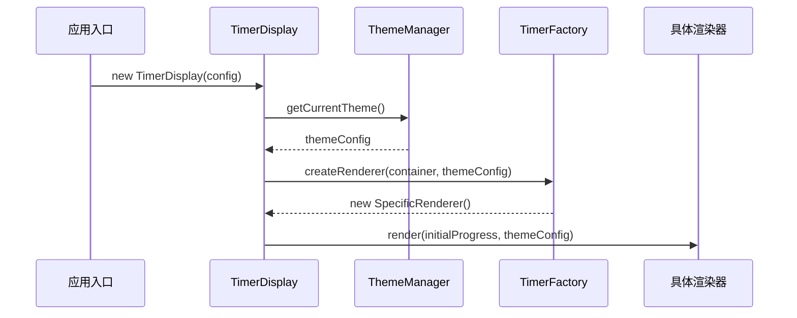
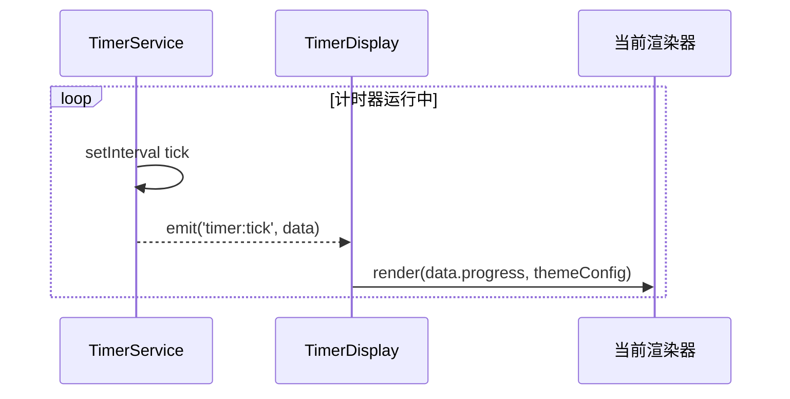
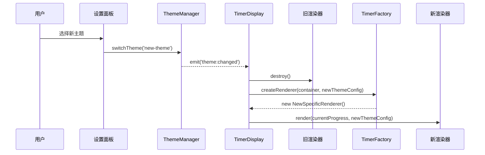

# 架构设计：主题与渲染系统

本文档详细阐述了 Tempus Ring 应用中的主题管理和时钟渲染系统的架构设计。

## 核心设计原则

- **数据驱动**: 渲染过程完全由 `TimerService` 提供的状态和数据驱动。
- **关注点分离**: 渲染逻辑、主题管理和计时器状态被清晰地分离到不同的服务和组件中。
- **可扩展性**: 系统设计允许轻松添加新主题或新的渲染技术，而无需大规模重构。
- **事件驱动通信**: 组件之间通过一个简单的事件发射器进行解耦通信，增强了模块化。

## 系统概览

系统主要由以下几个核心部分组成：

1. **`ThemeManager`**: 管理主题的定义、加载和切换。
2. **`TimerDisplay`**: 协调渲染流程，是视图层的核心控制器。
3. **`TimerFactory`**: 根据当前主题配置，创建相应的渲染器实例（策略模式）。
4. **`TimerRenderer` (接口)**: 定义了所有渲染器（如 Canvas, SVG, DOM）必须实现的通用接口。
5. **`TimerService`**: 维护计时器的核心状态和逻辑，并作为数据源。

## 主题系统 (`ThemeManager`)

`ThemeManager` 是主题系统的中枢，负责所有与主题相关的操作。

### 1. 主题定义

所有主题都在 `ThemeManager` 内部的 `themes` 对象中进行定义。每个主题配置 (`ThemeDefinition`) 包含以下关键属性：

- `name`: 主题的唯一标识符（`ThemeName`）。
- `displayName`: 用于在 UI 中显示的名称。
- `renderer`: **渲染器类型** (`'canvas'`, `'svg'`, or `'dom'`)。这是决定时钟如何绘制的关键。
- `colors`, `fonts`, `spacing`, `shadows`: 定义主题视觉风格的 token。
- `cssVariables`: 一组将应用于 `:root` 元素的 CSS 自定义属性。
- `styleSheet`: 与该主题关联的特定 CSS 文件的名称。

```typescript
// src/services/theme-manager.ts
private themes: Record<ThemeName, ThemeDefinition> = {
  [THEME_NAMES.WABISABI]: {
    config: {
      name: THEME_NAMES.WABISABI,
      renderer: 'canvas', // 使用 Canvas 渲染器
      // ... 其他视觉配置
    },
    cssVariables: { /* ... */ },
    styleSheet: 'wabisabi.css',
  },
  [THEME_NAMES.CLOUDLIGHT]: {
    config: {
      name: THEME_NAMES.CLOUDLIGHT,
      renderer: 'dom', // 使用 DOM 渲染器
      // ... 其他视觉配置
    },
    cssVariables: { /* ... */ },
    styleSheet: 'cloudlight.css',
  },
  // ... 其他主题
};
```

### 2. 主题切换流程

当用户选择一个新主题时，`ThemeManager.switchTheme()` 方法会执行以下操作：

1. **验证主题**: 检查所选主题是否存在。
2. **应用主题**: 调用内部的 `applyTheme()` 方法：
    a.  将新主题的 `cssVariables` 应用到 `document.documentElement` 的 `style` 上。
    b.  动态加载与主题相关的 CSS `styleSheet`（如果尚未加载）。
    c.  更新 `document.documentElement` 的 `className` 以反映当前主题（例如，`theme-wabisabi`）。
3. **持久化**: 将新主题的名称保存到 `localStorage`，以便在应用下次启动时恢复。
4. **发出事件**: 发出一个 `theme:changed` 事件，通知应用的其他部分（主要是 `TimerDisplay`）主题已更改。

## 时钟渲染流程 (`TimerDisplay`)

`TimerDisplay` 是一个 UI 组件，它将计时器数据和当前主题结合起来，以在屏幕上呈现视觉效果。

### 1. 初始化流程

1. **实例化**: `TimerDisplay` 在应用启动时被创建。
2. **获取主题**: 它从 `ThemeManager` 获取当前主题的配置。
3. **创建渲染器**: 它调用 `TimerFactory.createRenderer()`，并传入渲染器容器元素和当前主题配置。`TimerFactory` 会根据主题配置中的 `renderer` 属性（`'canvas'`, `'svg'`, `'dom'`）返回一个具体的渲染器实例。
4. **初始渲染**: 新创建的渲染器会执行其 `render()` 方法，绘制出计时器的初始状态。



### 2. 数据驱动的更新循环

1. **计时器滴答**: `TimerService` 在其内部的 `setInterval` 循环中，定期（通常是每秒）发出 `timer:tick` 事件，并附带最新的 `TimerData`（包括 `remainingTime`, `progress` 等）。
2. **监听事件**: `TimerDisplay` 监听 `timer:tick` 事件。
3. **更新渲染器**: 当接收到事件时，`TimerDisplay` 会调用其 `updateRenderer()` 方法，该方法进而调用当前渲染器实例的 `render()` 方法，并传入新的进度数据。
4. **视觉更新**: 渲染器根据新的进度数据更新其视觉表现（例如，重绘 Canvas、更新 SVG 路径或修改 DOM 元素）。



### 3. 主题切换时的渲染器重建

这是确保渲染逻辑与主题保持同步的关键机制。

1. **监听主题变化**: `TimerDisplay` 监听由 `ThemeManager` 发出的 `theme:changed` 事件。
2. **重建渲染器**: 当事件触发时，`TimerDisplay` 会执行 `recreateRenderer()` 方法：
    a.  调用当前渲染器的 `destroy()` 方法来清理资源（例如，移除事件监听器、清除 Canvas）。
    b.  清空渲染器容器的 HTML 内容。
    c.  重复**初始化流程**中的第 3 步，使用 `TimerFactory` 为新主题创建一个全新的渲染器实例。
3. **无缝切换**: 新的渲染器接管渲染任务，确保视觉效果与新主题的 `renderer` 类型和配置完全匹配。



## 关键文件参考

- **主题管理器**: `src/services/theme-manager.ts`
- **渲染协调器**: `src/components/timer-display.ts`
- **渲染器工厂**: `src/factories/timer-factory.ts`
- **渲染器实现**: `src/components/renderers/`
- **计时器服务**: `src/services/timer-service.ts`
- **类型定义**: `src/types/`
