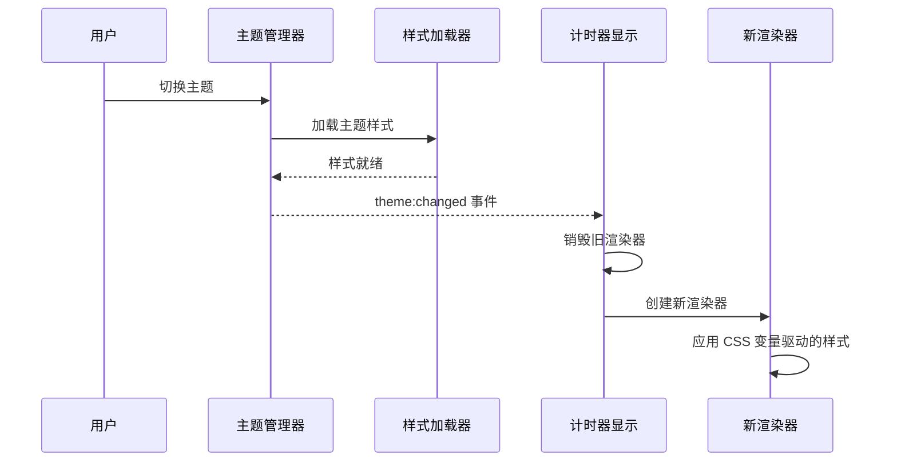

# 架构设计：主题与渲染系统

本文档详细阐述了 Tempus Ring 应用中的主题管理和时钟渲染系统的架构设计。

## 核心设计原则

- **数据驱动**: 渲染过程完全由 `TimerService` 提供的状态和数据驱动
- **样式与逻辑分离**: 所有静态样式由 CSS 决定，仅在动态渲染需求无法通过 CSS 实现时才在 TypeScript 中处理
- **CSS 变量驱动**: 动态效果通过 CSS 自定义属性和数据属性控制，避免直接样式操作
- **分层架构**: 采用 base/layout/components/themes 四层样式架构，确保可维护性
- **渲染器适配**: 不同主题采用各自适合的渲染方式（DOM/SVG/Canvas）

## 新样式系统架构

### 1. 分层样式系统

```
src/styles/
├── base/                    # 基础层 - 系统级样式
│   ├── reset.css           # CSS 重置和标准化
│   ├── variables.css       # 全局 CSS 变量系统
│   └── animations.css      # 通用动画定义
├── layout/                  # 布局层 - 结构和定位
│   └── grid.css            # 网格系统和响应式布局
├── components/              # 组件层 - UI 组件样式
│   ├── buttons.css         # 按钮组件样式
│   └── timer.css           # 计时器组件样式
└── themes/                  # 主题层 - 主题特定样式
    ├── cloudlight-variables.css    # Cloudlight 主题变量
    ├── cloudlight.css              # Cloudlight 主题样式
    ├── wabisabi-variables.css      # WabiSabi 主题变量
    ├── wabisabi.css               # WabiSabi 主题样式
    └── ... (其他主题)
```

### 2. CSS 变量驱动系统

**全局动态变量** (`base/variables.css`):
```css
:root {
  /* 动画控制变量 - 由 JavaScript 更新 */
  --progress: 0;                      /* 计时器进度 (0-1) */
  --rotation: 0deg;                   /* 当前旋转角度 */
  --intensity: 0;                     /* 动画强度 (0-1) */
  --state: 'idle';                    /* 当前计时器状态 */
}
```

**主题特定变量** (`themes/*-variables.css`):
```css
.theme-cloudlight {
  --primary-color: #1f2937;
  --accent-color: #ef4444;
  --hand-transition: transform 1000ms linear;
  --will-change: transform;
  --contain: layout style;
}
```

### 3. 数据属性状态控制

渲染器使用数据属性而非直接样式操作：

```typescript
// ✅ 正确方式 - 使用数据属性和 CSS 变量
this.container.style.setProperty('--progress', progress.toString());
this.container.style.setProperty('--intensity', intensity.toString());
this.hand.dataset.animationState = isRunning ? 'running' : 'paused';

// ❌ 错误方式 - 直接操作样式
this.hand.style.background = handColor;
this.hand.style.transform = `rotate(${rotation}deg)`;
```

对应的 CSS 控制：
```css
/* 基于数据属性的状态控制 */
.timer-hand[data-animation-state="running"] {
  transition: transform var(--hand-transition);
}

.timer-hand[data-animation-state="paused"] {
  transition: none;
}

/* 基于 CSS 变量的动态效果 */
.timer-hand.timer-progress-dynamic {
  transform: translateX(-50%) rotate(var(--rotation, 0deg));
}

.timer-hand.timer-intensity-effects {
  --computed-intensity: calc(var(--intensity, 0) * 1.2);
  background: hsl(0, calc(60% + var(--computed-intensity) * 20%), 
                     calc(55% - var(--computed-intensity) * 10%));
}
```

## 主题配置系统

### 1. 主题样式配置接口

```typescript
export interface ThemeStyleConfig {
  cssFiles: string[];               // 必需的 CSS 文件
  variablesFile: string;           // CSS 变量定义文件
  rendererType: RendererType;      // 渲染器类型
  animations: {
    useCSS: boolean;               // 优先使用 CSS 动画
    fallbackToJS: boolean;         // 允许 JS 动画降级
    duration: number;              // 默认动画时长
  };
  performance?: {
    willChange?: string[];         // will-change 属性
    contain?: string;              // CSS containment
    layerize?: boolean;           // 强制创建合成层
  };
}
```

### 2. 主题配置映射

```typescript
export const THEME_STYLE_CONFIGS: Record<string, ThemeStyleConfig> = {
  cloudlight: {
    cssFiles: [
      '/src/styles/themes/cloudlight-variables.css',
      '/src/styles/themes/cloudlight.css'
    ],
    rendererType: 'dom',
    animations: { useCSS: true, fallbackToJS: false, duration: 200 }
  },
  
  wabisabi: {
    cssFiles: [
      '/src/styles/themes/wabisabi-variables.css',
      '/src/styles/themes/wabisabi.css'
    ],
    rendererType: 'canvas',
    animations: { useCSS: false, fallbackToJS: true, duration: 400 }
  }
  // ... 其他主题
};
```

## 渲染器架构

### 1. 渲染器类型分工

- **DOM 渲染器** (Cloudlight, Dawn-Dusk, Nightfall)
  - 适用于简单几何形状和标准动画
  - 完全基于 CSS 动画和变量
  - 性能优秀，易于调试

- **SVG 渲染器** (Artistic, Hand-Drawn)  
  - 适用于复杂形状和艺术效果
  - CSS + JavaScript 混合动画
  - 支持路径动画和滤镜效果

- **Canvas 渲染器** (WabiSabi)
  - 适用于手绘风格和像素级控制
  - JavaScript 驱动的帧动画
  - 支持 Rough.js 等特效库

### 2. 统一渲染接口

```typescript
export interface TimerRenderer {
  render(progress: number, theme: ThemeConfig): void;
  resize(width: number, height: number): void;
  destroy(): void;
  updateTime(timeString: string): void;
  setAnimationState(isRunning: boolean): void;
  createTicks(count: number): void;
}
```

### 3. CSS 优先的实现原则

```typescript
// 渲染器实现示例 - 优先使用 CSS
class CloudlightDOMRenderer extends DOMRenderer {
  private updateProgressVariables(progress: number): void {
    const intensity = Math.min(1, progress * 1.2);
    
    // ✅ 设置 CSS 变量，让 CSS 处理样式计算
    this.container.style.setProperty('--progress', progress.toString());
    this.container.style.setProperty('--intensity', intensity.toString());
    
    // ✅ 使用 CSS 类控制状态
    this.hand.classList.toggle('timer-intensity-effects', intensity > 0);
    
    // ✅ 使用数据属性触发 CSS 规则
    this.centerDot.dataset.progress = Math.round(progress * 100).toString();
  }
}
```

## 性能优化策略

### 1. CSS 合成层优化

```css
/* 关键动画元素启用硬件加速 */
.timer-container,
.timer-display,
.timer-progress-ring,
.timer-hand {
  will-change: var(--will-change, transform);
  contain: var(--contain, layout style);
  transform: translateZ(0); /* 强制创建合成层 */
}
```

### 2. 动画性能类

```css
.animate-gpu {
  will-change: transform;
  transform: translateZ(0);
}

.animate-composite {
  will-change: transform, opacity;
}
```

### 3. 响应式断点优化

```css
/* 减少小屏幕设备的动画复杂度 */
@media (max-width: 480px) {
  .timer-progress-ring {
    animation: rotate-clockwise var(--animation-duration) linear;
  }
}

@media (prefers-reduced-motion: reduce) {
  .timer-progress-ring,
  .timer-hand {
    animation: none !important;
    transition: none !important;
  }
}
```

## 主题切换流程

### 1. 样式加载机制

```typescript
export async function loadThemeStyles(themeName: string): Promise<void> {
  const config = getThemeStyleConfig(themeName);
  
  // 按依赖顺序加载 CSS 文件
  for (const cssFile of config.cssFiles) {
    await loadCSSFile(cssFile);
  }
  
  // 应用自定义属性
  if (config.customProperties) {
    applyCustomProperties(config.customProperties);
  }
  
  // 应用性能优化
  if (config.performance) {
    applyPerformanceOptimizations(config.performance);
  }
}
```

### 2. 渲染器适配流程



## 开发指导原则

### ✅ 推荐做法

1. **静态样式用 CSS**：布局、颜色、字体等静态属性必须在 CSS 中定义
2. **动态效果用变量**：进度、旋转等动态效果通过 CSS 自定义属性实现
3. **状态用数据属性**：运行/暂停状态使用 `data-*` 属性触发 CSS 规则
4. **性能优化内置**：为动画元素添加 `will-change` 和 `contain` 属性

### ❌ 避免做法

1. **直接操作 style**：避免 `element.style.property = value` 形式的样式设置
2. **内联样式**：避免在 HTML 或 JavaScript 中编写内联样式
3. **频繁 DOM 操作**：避免在动画循环中频繁修改 DOM 结构
4. **硬编码尺寸**：避免在 JavaScript 中硬编码像素值

## 关键文件参考

- **样式系统入口**: `src/styles/main.css`
- **主题配置**: `src/config/theme-styles.ts`  
- **渲染器基类**: `src/components/renderers/`
- **类型定义**: `src/types/theme-types.ts`, `src/types/renderer-types.ts`
- **主题变量**: `src/styles/themes/*-variables.css`
- **组件样式**: `src/styles/components/`